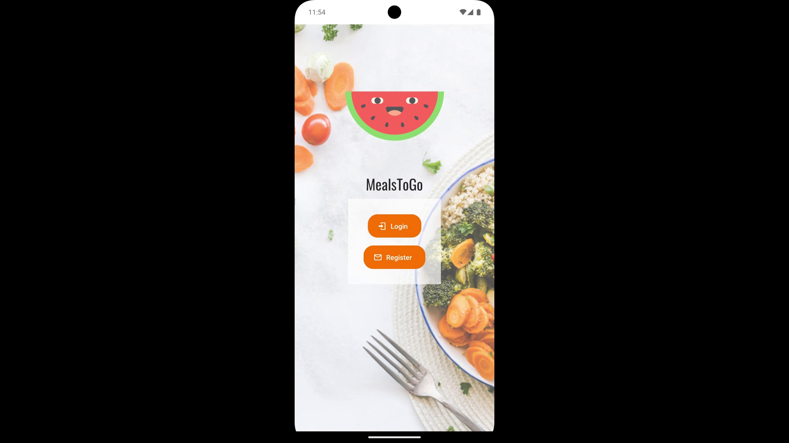
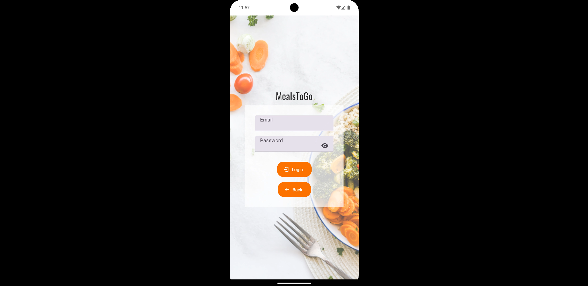
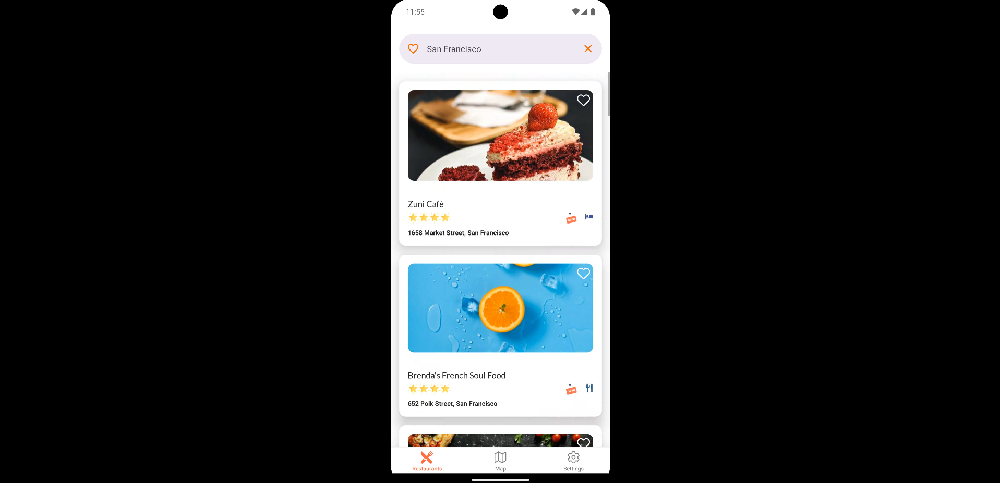
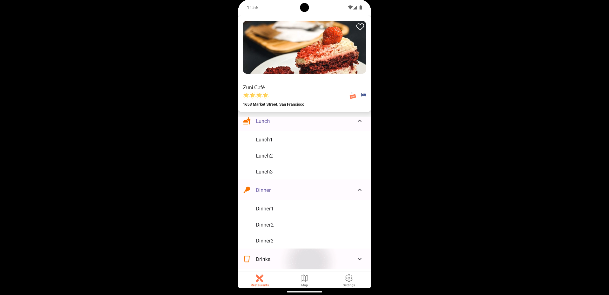
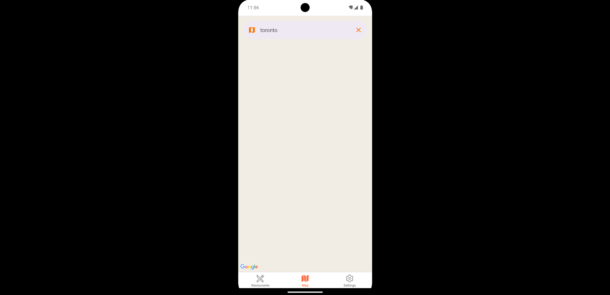
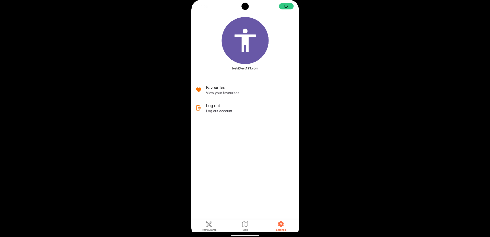
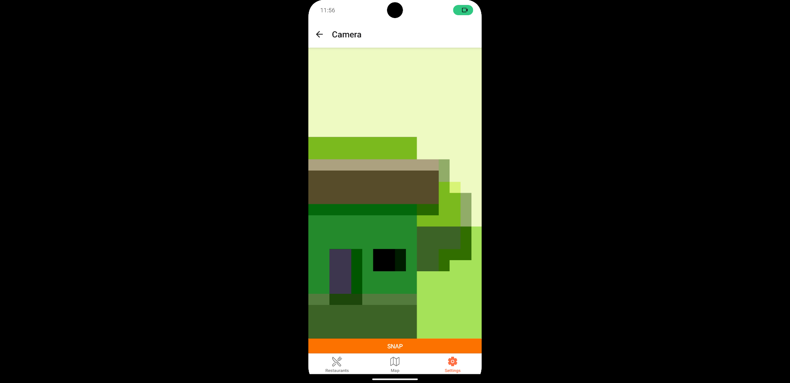

# 🍽️ MealsToGo  

A **React Native** mobile app for discovering restaurants, browsing menus, and finding great places to eat. Built with **React Native, Firebase, and Maps API**, this app provides a seamless experience for food lovers.  

## 🚀 Features  
✅ **Restaurant Listings** – Browse restaurants with ratings and images.  
✅ **Map Integration** – View restaurants on an interactive map.  
✅ **Favorites System** – Save your favorite places for quick access.  
✅ **Authentication** – Secure login with Firebase authentication.  
✅ **Smooth UI & Performance** – Optimized for fast, responsive navigation.  

## 🛠️ Tech Stack  
- **Frontend**: React Native, Expo  
- **Backend**: Firebase (Auth, Firestore)  
- **APIs**: Google Maps API, Places API  
- **State Management**: React Context API  

## 📸 Screenshots  

### Main Screen  
  

### Login Screen  
  

### Register Screen  
  

### Home Screen  
  

### Info Screen  
  

### Map Screen (Mpas isnt showing in development build because Google Maps API isn't free)
  

### Settings Screen  
  

### Camera Screen  
  

## 📦 Installation  
1. Clone the repository:  
   ```bash  
   git clone https://github.com/zainali28/MealsToGo.git  
   cd MealsToGo  
   ```  
2. Install dependencies:  
   ```bash  
   npm install  
   ```  
3. Start the app:  
   ```bash  
   npm run start  
   ```  

## 🔥 Future Improvements  
- Add **order & delivery tracking**  
- Implement **user reviews & ratings**  
- Dark mode support  

## 🤝 Contributing  
Contributions are welcome! Feel free to fork and submit a PR.  

## 📜 License  
This project is licensed under the **MIT License**.  
